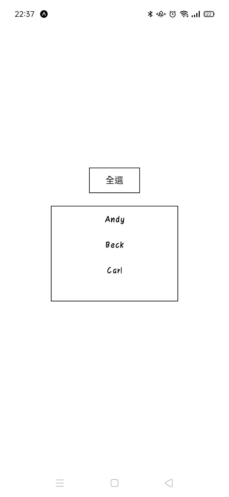
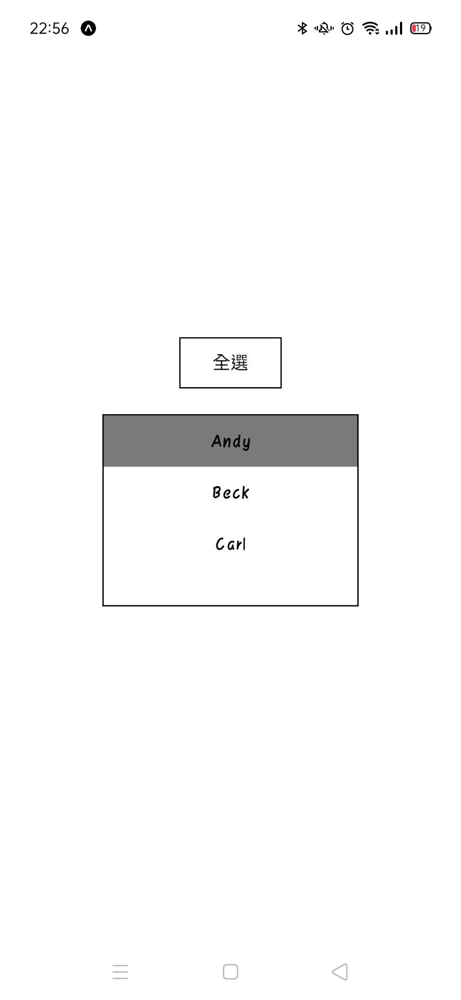
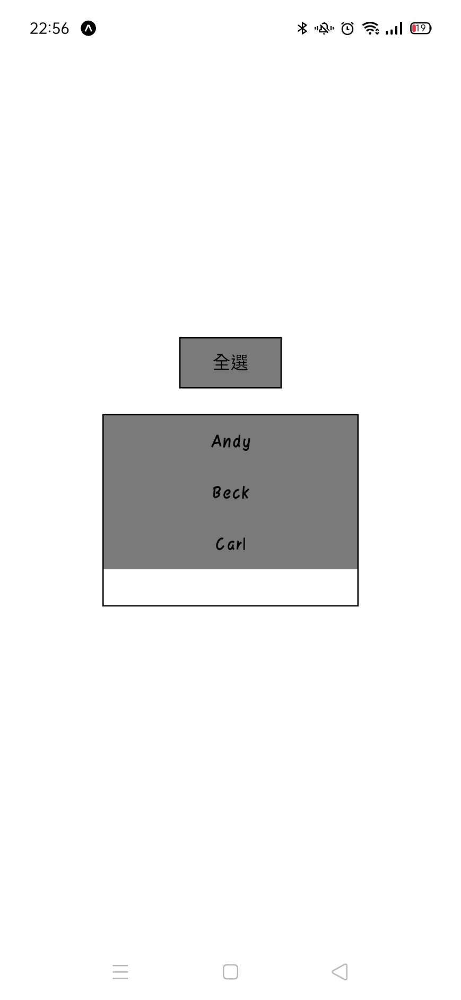

# FlatList-Rendering-Problem

## Start

`git clone https://github.com/roto93/FlatList-Rendering-Problem.git`

`cd FlatList-Rendering-Problem`

`npm install`

`npm start`

## Discription

最近在做專案時遇到類似的問題，於是做了一個摘要版

初始畫面看起來長左圖這樣，包含一個全選按鈕與一個FlatList列表，列表裡的三個項目也都是按鈕，這是模擬購物車的選取功能

點按列表內的項目，會改變顏色，代表選取(中間圖)

點案全選按鈕時，全選按鈕會變色，也會改變所有列表項目的顏色，達到全選的功能 (右圖)

<div style="display:flex">



</div>


## Full Code

```javascript
import React, { useState } from 'react';
import { FlatList, StyleSheet, Text, TouchableOpacity, View } from 'react-native';

const MOCK = [
  { name: 'Andy' },
  { name: 'Beck' },
  { name: 'Carl' },
]

export default function App() {
  const [selectAll, setSelectAll] = useState(false);

  const RenderData = ({ item }) => {
    const [isSelected, setIsSelected] = useState(selectAll);
    return (
      <TouchableOpacity
        onPress={() => { setIsSelected(prev => !prev) }}
        style={[styles.item_btn, { backgroundColor: isSelected ? '#7A7A7A' : 'transparent' }]}>
        <Text>{item.name}</Text>
      </TouchableOpacity>
    )
  }

  return (
    <View style={styles.container}>

      <View>
        <TouchableOpacity
          onPress={() => { setSelectAll(prev => !prev) }}
          style={[styles.selectAll_btn, { backgroundColor: selectAll ? '#7A7A7A' : 'transparent' }]}>
          <Text>全選</Text>
        </TouchableOpacity>
      </View>

      <View style={styles.flatlist_container}>
        <FlatList
          data={MOCK}
          renderItem={(cases) => <RenderData item={cases.item} />}
          keyExtractor={(cases, index) => index.toString()}
          style={{ width: '100%', }}
        />
      </View>

    </View >
  );
}

const styles = StyleSheet.create({
  container: {
    flex: 1,
    backgroundColor: '#fff',
    alignItems: 'center',
    justifyContent: 'center',
  },
  selectAll_btn: {
    borderWidth: 1,
    width: 80,
    height: 40,
    justifyContent: 'center',
    alignItems: 'center',
  },
  flatlist_container: {
    borderWidth: 1,
    width: 200,
    height: 150,
    alignItems: 'center',
    marginTop: 20,
  },
  item_btn: {
    height: 40,
    justifyContent:'center', 
    alignItems: 'center',
  },
});

```

## Problem

現在的問題是全選和個別選取的功能不能好好配合，見[影片一](https://youtu.be/OZMWCkcbWW8)，可以看到如果在全選狀態下再點擊個別項目，全選按鈕不會取消

我希望在維持現有功能的前提下，讓列表外的 `selectAll` state 能夠判斷列表內的 `isSelected` state 是否「都是 true」，若是，則自動變成`selectAll==true`

但如果直接在個別項目內的`onPress`加上`setSelectAll(false)` 卻行不通，見[影片二](https://youtu.be/zvPWE-KRCoQ)

因為一旦 `selectAll` 改變，FlatList 就會重新 render，導致所有項目一致變成選取/未選取

目前不知道有什麼好辦法解決
